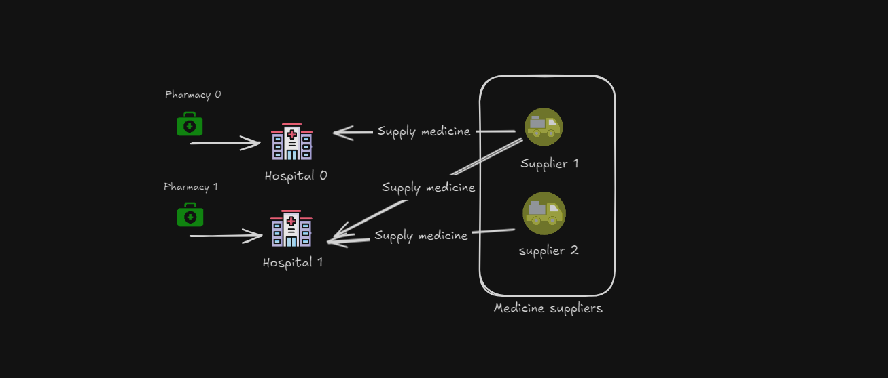
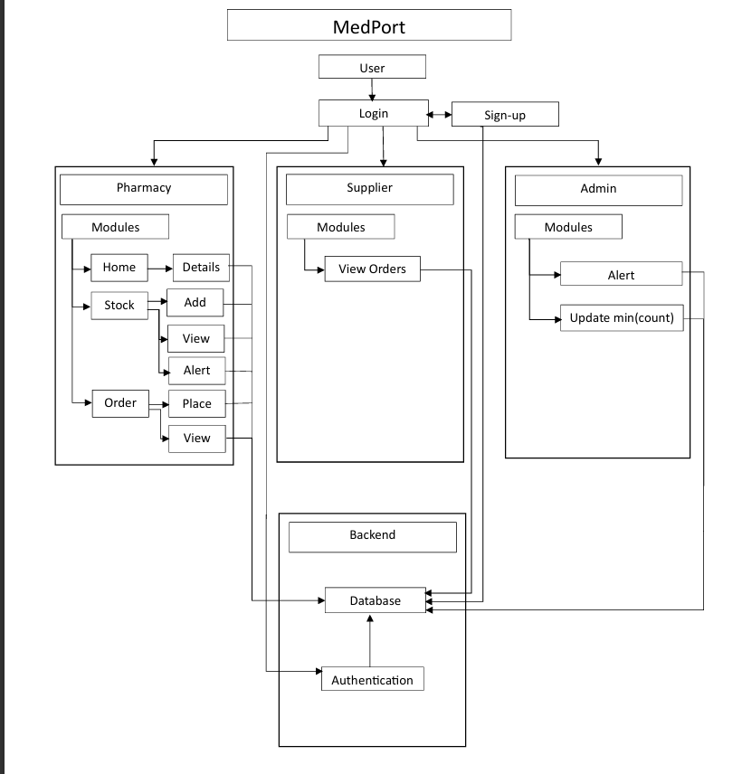

# Pill-Point-Java

# PillPoint
### Technologies planning to use

### The structure



### we will be also planning to give an updates page which will basically say about the versions and their releases like the one for gemini ai
# The evolution of Idea
- https://www.indiatoday.in/india/story/no-medicine-shortage-patients-last-stage-maharashtra-nanded-government-hospital-deaths-2443689-2023-10-03
- https://www.indiaspend.com/more-indians-die-of-poor-quality-care-than-due-to-lack-of-access-to-healthcare-1-6-million-64432/
- https://www.biospectrumindia.com/news/17/14709/27-deaths-in-india-caused-by-poor-access-to-drugs-and-knowledge-medicus-.html

These where the main reasons which paved for the development of this project

# The concpet
- We are planning to create a software , that is web or web app inorder to monitor the stock of medicines in the pharmacy of a particular hospital .
- How the medicines are supplied to a hospital form a particular manufacturer -- The medical represnetative from a particular company visits the senior doctor of a hospital and introduces about his/her medicine and provides sample to doctor inorder to test it out . The doctor tests it and if he likes he can give further order of these medicines to the hospital to that particular manufacturer or company . So if a medicine is out of stock then or if the medicine has very less amnount in stock , then it is the duty of the pharmacy team to order that medicine manually .
- The main problem which arises is when the hospitals do not make the order of an adequate amount of medicine for them , that is inorder to save money the do not order every medicine and if medicines are not relevant at a current time for example chicken pox , dengue fever etc , they are not gonna order it until a case gets reported on their hospitals .
- So what our software does is , we are gonnna keep track of each and every medicine in a pharmcacy of each and every individual hospitals and then demand that there should a threshold amount or minimum amount of medicine requeired in a hospital , we can make that mandatory . And whenever the amount of medicine goes below out of stock then a request will be sent automatically to their manufactures and can send confirmation order for their request . And in case if any hospital doesnot accpet the confirmation order or refuese to keep the particular amount in their inventory then strict actions will be taken from the govt side . That is we can make this even a criteria for maintaing the license of hopstials . 

#### SPECS
java 21
maeven
jar
3.4.0 spring boot

#### Block diagram


### Folder organisation structure
```commandline
medport/                
|── src/
│   ├── main/
│   │   ├── java/com/medport/
│   │   │   ├── controllers/      # REST Controllers
│   │   │   │   ├── AdminController.java
│   │   │   │   ├── PharmacyController.java
│   │   │   │   ├── SupplierController.java
│   │   │   │   ├── AuthController.java
│   │   │   ├── services/         # Service Layer
│   │   │   │   ├── AdminService.java
│   │   │   │   ├── PharmacyService.java
│   │   │   │   ├── SupplierService.java
│   │   │   │   ├── AuthService.java
│   │   │   ├── repositories/     # Data Access Layer (Spring Data JPA Repos)
│   │   │   │   ├── MedicineRepository.java
│   │   │   │   ├── OrderRepository.java
│   │   │   │   ├── UserRepository.java
│   │   │   │   ├── AlertRepository.java
│   │   │   ├── models/           # Entity Classes
│   │   │   │   ├── Medicine.java
│   │   │   │   ├── Order.java
│   │   │   │   ├── User.java
│   │   │   │   ├── Alert.java
│   │   │   ├── MedPortApplication.java  # Main Application Class
│   │   ├── resources/
│   │   │   ├── application.properties  # Application Configurations
│   │   │   ├── templates/              # Thymeleaf Templates (If using)
│   │   │   │   ├── login.html
│   │   │   │   ├── dashboard.html
│   │   │   ├── static/                 # Static Resources
│   │   │   │   ├── css/
│   │   │   │   ├── js/
│   │   │   │   ├── images/
│   ├── test/
│       ├── java/com/medport/
│           ├── controllers/
│           ├── services/
│           ├── MedPortApplicationTests.java
├── .gitignore
├── pom.xml                            # Maven Dependencies
├── README.md
```

### The functioning
- The login will be for three roles - admin (the health agencies) , pharmacies (Hospital's pharmacies) and suppliers (medicine producing agencies)
- Admin - view which all pharmacies doesnot have the adequate amount of stocks , send warnings take actions etc , also can set the threshold amount for each medicine
- Supplier - can view received orders , supply to the hospitals of the order and if a low stock is indicated can send the request for buying that particualar medicine(optional)
- Pharmacy - the hospital which have to update the inventroy of the stock of the medicine , suppose to do CRUD on the resources
